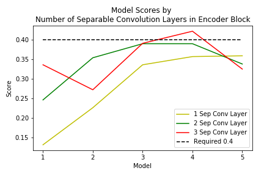

# Udacity RoboND - Project 4: Deep Learning - Follow Me

In this project we are given images taken from a quadcopter and we are trying to identify a target ("what") in an image and determine "where" in the image the target is located.  To do this we need to build a neural network model.  A typical classification model only needs to understand what is in an image and does not retain pixel spatial information.  However, in order to understand where an object resides in an image we need keep the spatial information for each pixel and assign the pixels to a category or object class.  For this we need to use a fully convolutional network (FCN) which retains spatial information, rather than a fully connected network which does not.

A fully convolutional network can extract features with different levels of complexity and segment them into separate categories. 

In this project we are interested in segmenting the pixels into three classses: 

  1) the target person ("hero") that we want the quadcopter to identify and follow
  2) other people  
  3) the background  

### A: Fully Convolutional Network Defined   
---
A Fully Convolutional Network (FCN) consists of three sections: 

    Encoders: 
        a downsampling path which captures contextual information, but loses spatial information.  

    1x1 Convolution Layer: 
        helps to reduce the dimensionality of a layer without losing information about pixel locations.  

    Decoders: 
        an upsampling path which recovers lost spatial information and restores the image to it's original size.  

The single encoder block (layer) consists of a separable convolutional 2D layer along with batch normalization.

    def encoder_block(input_layer, filters, strides):
        output_layer = separable_conv2d_batchnorm(input_layer, filters=filters, strides=strides)
        return output_layer

Each encoder layer allows the model to gain a better understanding of the shapes in the image at the expense of losing spatial information.

_Separable Convolutional 2D with Batch Normalization_

Separable convolution layers are a convolution technique for increasing model performance by reducing the number of parameters in each convolution. This is achieved by performing a spatial convolution while keeping the channels separate, followed with a depthwise convolution. Instead of traversing the each input channel by each output channel and kernel, separable convolutions traverse the input channels with only the kernel, then traverse each of those feature maps with a 1x1 convolution for each output layer, before adding the two together. This technique allows for the efficient use of parameters.

    def separable_conv2d_batchnorm(input_layer, filters, strides=1):
        output_layer = SeparableConv2DKeras(filters=filters,kernel_size=3, strides=strides,
                                            padding='same', activation='relu')(input_layer)
        output_layer = layers.BatchNormalization()(output_layer) 
        return 

Batch normalization allows the network to learn more quickly by limiting large changes in the activation functions inside the network.

_Convolutional 2D with Batch Normalization_

With a 1x1 convolution layer, the data is flattened while still retaining spatial information from the encoder. An additional benefit of 1x1 convolutions is that they are an efficient approach for adding extra depth to the model.

    def conv2d_batchnorm(input_layer, filters, kernel_size=3, strides=1):
        output_layer = layers.Conv2D(filters=filters, kernel_size=kernel_size, strides=strides,
                                     padding='same', activation='relu')(input_layer)
        output_layer = layers.BatchNormalization()(output_layer)
        return output_layer  

The decoder block is comprised of three parts:  

1) A bilinear upsampling layer.  
2) A layer to concatenate the upsampled small input layer and the large input layer.   
3) Some (one or more) additional separable convolution layers to extract some more spatial information from prior layers.   

The decoder block calculates the separable convolution layer of the concatenated bilinear upsample of the smaller input layer with the larger input layer. This structure mimics the use of skip connections by having the larger decoder block input layer act as the skip connection.  Skip connections allow the network to retain spatial information from prior layers that were lost in subsequent convolution layers. Skip layers use the output of one layer as the input to another layer. By using information from multiple image sizes, the model is able to make more precise segmentation decisions.

    def decoder_block(small_ip_layer, large_ip_layer, filters):
        upsample = bilinear_upsample(small_ip_layer)
        concat = layers.concatenate([upsample, large_ip_layer])
        output_layer = separable_conv2d_batchnorm(concat, filters=filters, strides=1)
        return output_layer  

Each decoder layer is able to reconstruct a little bit more spatial resolution from the layer before it. The final decoder layer will output a layer the same size as the original model input image, which will be used for guiding the quadcopter.

_Bilinear Upsampling_

Bilinear upsampling uses the weighted average of the four nearest known pixels from the given pixel, estimating the new pixel intensity value. Although bilinear upsampling loses some finer details when compared to transposed convolutions, it has much better performance, which is important for training large models quickly.

    def bilinear_upsample(input_layer):
        output_layer = BilinearUpSampling2D((2, 2))(input_layer)
        return output_layer  

### B: Model Evaluation
---

To evaluate how well the model has performed the metric Intersection over Union (IoU) is calculated.  IoU measures how much (in precent of pixels) the ground truth image overlaps with the segmented image from the FCN model.  

    Intersection over Union (IoU) = Area of Overlap / Area of Union    

Scoring:  

To arrive at a final score we need to calculate 

    1) Scores for while the quad is following behind the target:
    
        true_pos1, false_pos1, false_neg1, IoU1

    2) Scores for images while the quad is on patrol and the target is not visable:
    
        true_pos2, false_pos2, false_neg2, iou2

    3) This score measures how well the neural network can detect the target from far away:
    
        true_pos3, false_pos3, false_neg3, iou3

    Sum all the true positives, etc from the three datasets to get a weight for the score:
    
        true_pos = true_pos1 + true_pos2 + true_pos3
        false_pos = false_pos1 + false_pos2 + false_pos3
        false_neg = false_neg1 + false_neg2 + false_neg3
        weight = true_pos / (true_pos + false_neg + false_pos)

    The IoU for the dataset that never includes the hero is excluded from grading:
    
        final_IoU = (iou1 + iou3)/2

    The final score is:
    
        final_IoU * weight

### c: Model Results   
---
I tried various combinations of FCNs with increasingly deeper layers to achieve the required final score > 0.40.  During early investigations on model performance I noticed a few things that drove me to my architectures and hyperparamters used for further analysis.

 - training and validation tended to diverge after 10 to 20 epochs -> I chose to stop my models at 20 epochs
 - a higher learning rate with 20 epochs seemed to work better -> I chose 0.01
 - the models performed better when the middle 1x1 conv layer was smaller rather than larger
 - I needed to find the balance between too few layers and too many layers -> I chose to try out 1 to 5 enc/dec layers.
 - multiple separable convolution layers in the decoder block seemed to work better -> I tried out 1 to 3 layers for each model.
 
Below are the models I set up for analysis.  For each model I included 3 scenarios with 1, 2, or 3 separable convolution layers in the decoder block for a total of 15 total model runs.  For my model runs I used the original training and validation data provided.  
 
      Model 1        Model 2        Model 3        Model 4         Model 5  
      ------------   ------------   ------------   -------------   -------------  
      Inputs         Inputs         Inputs         Inputs          Inputs  
      Encoder(16)    Encoder(16)    Encoder(16)    Encoder(16)     Encoder(16)  
                     Encoder(32)    Encoder(32)    Encoder(32)     Encoder(32)  
                                    Encoder(64)    Encoder(64)     Encoder(64)  
                                                   Encoder(128)    Encoder(128)  
                                                                   Encoder(256)  
      1x1Conv(16)    1x1Conv(32)    1x1Conv(64)    1x1Conv(128)    1x1Conv(256)  
                                                                   Decoder(256)  
                                                   Decoder(128)    Decoder(128)  
                                    Decoder(64)    Decoder(64)     Decoder(64)  
                     Decoder(32)    Decoder(32)    Decoder(32)     Decoder(32)  
      Decoder(16)    Decoder(16)    Decoder(16)    Decoder(16)     Decoder(16)  
      Outputs        Outputs        Outputs        Outputs         Outputs  
      ------------   ------------   ------------   -------------   -------------  
      Note: Number of filters in ()  

The hyperparameters and model results for each run were:  

    learning_rate = 0.01   # Determines how quickly a model learns
    batch_size = 64        # How many images go through model at one time 
    num_epochs = 20        # How many times the model uses all the data
    steps_per_epoch = 65   # chosen to be 4131 training images // batch_size
    validation_steps = 16  # chosen to be 1184 validation images // batch_size

All the hyperparameters were determined through brute force, aside from number of steps which were a function of images and batch size.  The trickiest parameters were the learning rate and the number of epochs.  If the learning rate is too high the model can learn too quickly and change it weights too much from epoch to epoch.  If the learning rate is too low the model will learn too slowly and may get stuck for a long time without finding a good solution.  Because the computation time for these models can be quite long I tried to focus on parameters for learning and epochs that would get me to the desired solution in the least amount of time.  

Batch size and steps per epoch parameters also had an effect on the model results but because I did not have time to test out all hyperparameter combinations I stuck with the largest batch size that would allow my models to fit in memory.  Again, steps per epoch were chosen to be a function of number of images and batch size.

Model Results:  

Model | 1 Sep Conv | 2 Sep Conv | 3 Sep Conv |  
:---: | :----:     | :----:     | :---:      |  
1     | 0.131      | 0.246      | 0.336      |  
2     | 0.226      | 0.354      | 0.272      |  
3     | 0.336      | 0.390      | 0.391      |  
4     | 0.357      | 0.390      | 0.425      |  
5     | 0.359      | 0.338      | 0.325      |  

Model 4 with 3 separable convultion layers in the encoder block had the largest score (0.425) in my runs and was also above the required 0.40 so I chose that as my final model.

To summarize final chosen fully convolutional network consisted of:  

    Inputs (?, 160x16x3 Images)
    Encoder Layer 1, 16 Filters, Stride=2
    Encoder Layer 2, 32 Filters, Stride=2
    Encoder Layer 3, 64 Filters, Stride=2
    Encoder Layer 4, 128 Filters, Stride=2
    1x1 convolutional Layer, 128 Filters
    Decoder Layer 4, 128 Filters, skip connection from Encoder Layer 3
    Decoder Layer 3, 64 Filters, skip Connection from Encoder Layer 2
    Decoder Layer 2, 32 Filters, skip Connection from Encoder Layer 1    
    Decoder Layer 1, 16 Filters, skip Connection from Inputs
    Output Layer

Hyperparameters:

    learning_rate = 0.01   # Determines how quickly a model learns
    batch_size = 64        # How many images go through model at one time 
    num_epochs = 20        # How many times the model uses all the data
    steps_per_epoch = 65   # chosen to be 4131 training images // batch_size
    validation_steps = 16  # chosen to be 1184 validation images // batch_size

### D: Future Enhancements  
---

Most of my model runs were less that the required 0.40 score and I felt that I should have had better success.  If I had more time I would have liked to try out a few things:

    1 Collect more data - particularly for where the model performed the worst - locating the target from a distance.
    2 Pooling and dropout layers - perhaps this could have prevented the overfitting beyond 20 epochs.
    3 Different model architectures - larger models that may require more memory.

This model could also be used for tracking other objects like animals and vehicles which have particular and detectible shapes.  To do this would require capturing data for those objects and retraining the model.

